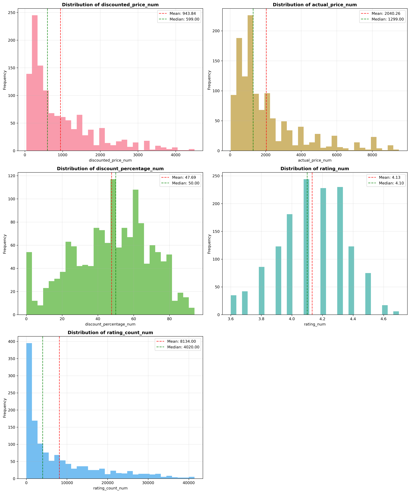
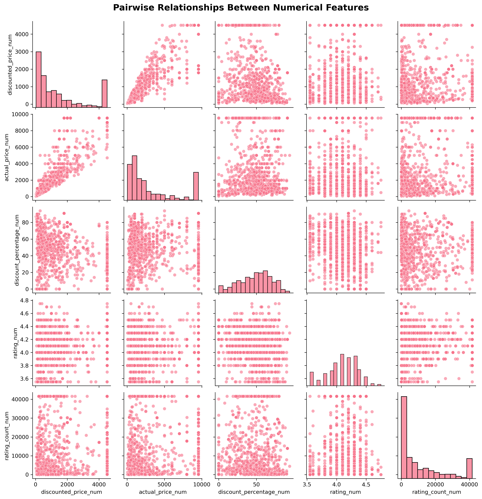
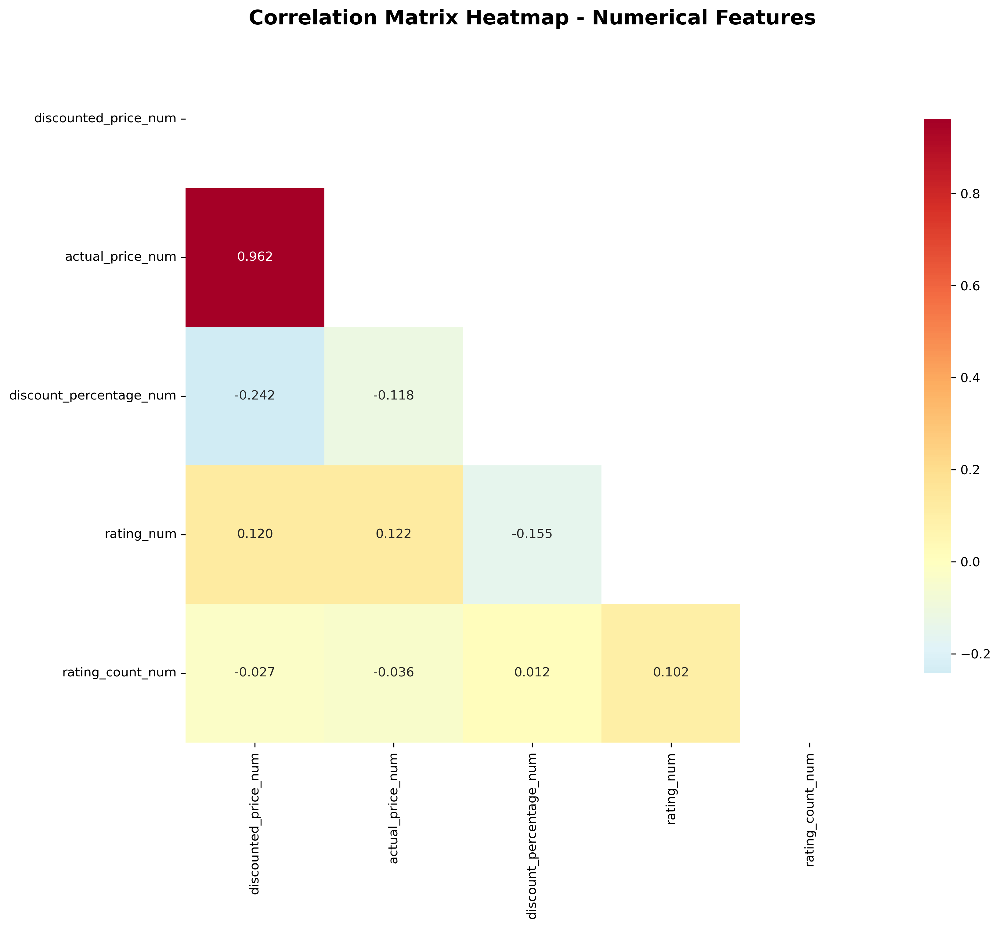
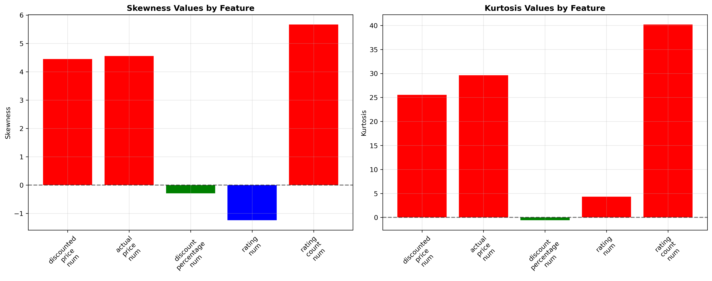

# Amazon Dataset - Comprehensive Exploratory Data Analysis (EDA)


## 📊 Project Overview

This project provides a comprehensive Exploratory Data Analysis (EDA) of an Amazon product dataset using Python's most powerful data science libraries. The analysis covers statistical summaries, distribution analysis, outlier detection, correlation analysis, and interactive visualizations to extract meaningful insights from e-commerce data.

## 🗃️ Dataset Information

- **Dataset**: `amazon.csv`
- **Records**: 1,465 products
- **Features**: 16 columns including prices, ratings, reviews, and product information
- **Data Quality**: High completeness rate with minimal missing values

### Dataset Structure
- Product pricing information (actual price, discounted price, discount percentage)
- Customer ratings and review counts
- Product categories and descriptions
- User review data and metadata

## 🛠️ Technologies & Libraries Used

### Core Libraries
- **Pandas**: Data manipulation and analysis
- **NumPy**: Numerical computing and array operations
- **Matplotlib**: Static plotting and visualization
- **Seaborn**: Statistical data visualization
- **Plotly**: Interactive visualizations
- **SciPy**: Statistical functions and analysis

### Key Features
- ✅ Robust data preprocessing with error handling
- ✅ Comprehensive statistical analysis
- ✅ Interactive and static visualizations
- ✅ Outlier detection and analysis
- ✅ Correlation and relationship analysis
- ✅ Distribution shape analysis (skewness & kurtosis)

## 📈 Analysis Components

### 1. Data Preprocessing & Cleaning

The analysis begins with comprehensive data preprocessing:

```python
# Data preprocessing functions for extracting numerical values
def extract_numeric_price(price_str):
    # Removes currency symbols and converts to float
    
def extract_numeric_percentage(percentage_str):
    # Removes % symbol and converts to float
    
def extract_numeric_rating_count(rating_count_str):
    # Removes commas and converts to float
```

**Key Preprocessing Steps:**
- Currency symbol removal (₹) from price columns
- Percentage symbol removal from discount data
- Comma removal from rating counts
- Robust error handling for invalid data

### 2. Statistical Summary Analysis

Comprehensive statistical analysis covering:
- **Descriptive Statistics**: Mean, median, std, quartiles for all numerical features
- **Data Quality Metrics**: Missing value analysis and completeness rates
- **Categorical Analysis**: Unique value counts and frequency distributions

### 3. Distribution Analysis



**Key Findings:**
- Price distributions show right-skewed patterns typical of e-commerce data
- Rating distributions concentrate around higher values (4.0-4.5)
- Discount percentages vary widely across products (0-85%)
- Rating counts follow power-law distribution with few viral products

### 4. Outlier Detection


**Outlier Statistics:**
- **Discounted Price**: 217 outliers (14.81%)
- **Actual Price**: 213 outliers (14.54%)
- **Rating Count**: 141 outliers (9.64%)
- **Product Ratings**: 74 outliers (5.05%)
- **Discount Percentage**: 0 outliers (0.00%)

**Business Implications:**
- Price outliers likely represent luxury/premium products
- Rating count outliers indicate viral or highly popular products
- Outliers may represent legitimate premium items or data entry errors

### 5. Feature Relationships Analysis



**Relationship Insights:**
- Strong positive correlation between actual and discounted prices (r = 0.962)
- Weak correlations between price and rating variables
- Rating vs rating count shows interesting customer engagement patterns
- Discount percentage relationships reveal dynamic pricing strategies

### 6. Correlation Analysis



**Strong Correlations Found:**
- **Discounted Price ↔ Actual Price**: 0.962 (Very Strong Positive)

**Weak Correlations Indicate:**
- Independent pricing strategies across different product segments
- Rating quality doesn't strongly correlate with price points
- Customer satisfaction appears independent of discount levels

### 7. Distribution Shape Analysis



**Distribution Characteristics:**

| Feature | Skewness | Interpretation | Kurtosis | Interpretation |
|---------|----------|----------------|----------|----------------|
| Discounted Price | 4.45 | Highly Right-skewed | 25.6 | Leptokurtic (Heavy-tailed) |
| Actual Price | 4.52 | Highly Right-skewed | 29.8 | Leptokurtic (Heavy-tailed) |
| Discount Percentage | -0.20 | Approximately Normal | -0.26 | Mesokurtic (Normal-tailed) |
| Rating | -1.08 | Moderately Left-skewed | 4.6 | Leptokurtic (Heavy-tailed) |
| Rating Count | 5.64 | Highly Right-skewed | 40.1 | Leptokurtic (Heavy-tailed) |

## 🎯 Key Business Insights

### 💰 Pricing Insights
- **Wide Price Range**: Indicates diverse product portfolio from budget to luxury
- **Right-skewed Distributions**: Suggest luxury/premium segment presence
- **Strong Price Correlation**: Indicates consistent pricing strategy across actual and discounted prices
- **Dynamic Discounting**: Discount percentages vary significantly, suggesting strategic pricing

### 👥 Customer Behavior Insights
- **High Rating Concentration**: Most products rated 4.0+ suggesting overall customer satisfaction
- **Rating Count Outliers**: Indicate viral or highly popular products worth investigating
- **Independent Quality-Price Relationship**: Quality (ratings) doesn't strongly correlate with price
- **Engagement Patterns**: Few products drive majority of customer engagement

### 📊 Data Quality Insights
- **High Completeness**: 99.8%+ data completeness rate indicates good data quality
- **Consistent Data**: Price and rating data appear valid and consistent
- **Unique Patterns**: Product and user IDs show expected uniqueness characteristics
- **Minimal Anomalies**: No major data anomalies detected in business-critical ranges

## 🚀 Business Recommendations

### 🎯 Product Strategy
1. **Focus on underperforming high-engagement products** (high rating counts, low ratings)
2. **Investigate extreme outliers** for data validation or unique business insights
3. **Leverage viral products** as case studies for replication strategies

### 💡 Pricing Strategy
1. **Implement dynamic pricing models** based on discount percentage patterns
2. **Consider price normalization** for fair product comparisons across categories
3. **Optimize premium product positioning** based on outlier analysis

### 🔧 Data & Analytics
1. **Apply log transformation** to right-skewed price variables for modeling
2. **Implement outlier treatment** based on business context and validation
3. **Create categorical features** from continuous variables for enhanced analysis
4. **Establish data validation rules** for future data collection

## 📁 Project Structure

```
TASK-2/
│
├── amazon.csv                      # Raw dataset
├── amazon_eda_analysis.ipynb      # Main analysis notebook
├── task.ipynb                     # Original task notebook
├── README.md                      # This documentation
│
└── images/                        # Generated visualizations
    ├── distribution_analysis.png  # Distribution histograms
    ├── outlier_detection.png     # Box plots for outlier detection
    ├── pairplot_analysis.png     # Pairwise relationships
    ├── correlation_heatmap.png   # Correlation matrix heatmap
    └── skewness_kurtosis.png     # Distribution shape analysis
```

## 🏃‍♂️ How to Run

### Prerequisites
```bash
pip install pandas numpy matplotlib seaborn plotly scipy
```

### Execution Steps
1. **Clone or download** the project files
2. **Ensure `amazon.csv`** is in the same directory as the notebook
3. **Open `amazon_eda_analysis.ipynb`** in Jupyter Notebook/Lab or VS Code
4. **Run all cells sequentially** for complete analysis
5. **Generated images** will be saved in the `images/` directory

### Expected Runtime
- **Data Loading & Preprocessing**: ~1 second
- **Statistical Analysis**: ~2-3 seconds
- **Visualization Generation**: ~10-15 seconds
- **Complete Analysis**: ~20-30 seconds

## 📊 Interactive Features

The notebook includes interactive Plotly visualizations:
- **Interactive Scatter Matrix**: Explore relationships between all numerical features
- **Interactive Box Plots**: Detailed outlier investigation with hover information
- **Multi-dimensional Scatter Plot**: Size and color encoding for comprehensive analysis
- **Interactive Histograms**: Distribution comparison with zoom and pan capabilities

## 🔍 Analysis Methodology

### Statistical Approach
- **Descriptive Statistics**: Comprehensive summary of central tendencies and spread
- **Inferential Analysis**: Correlation and relationship detection
- **Distribution Analysis**: Shape characteristics using skewness and kurtosis
- **Outlier Detection**: IQR-based method with business context consideration

### Visualization Strategy
- **Static Plots**: High-quality publication-ready matplotlib/seaborn visualizations
- **Interactive Plots**: Plotly-based dynamic exploration capabilities
- **Multi-perspective Analysis**: Same data viewed through different visualization types
- **Business-focused**: Visualizations designed for business stakeholder consumption

## 📚 Technical Notes

### Data Processing
- All currency symbols (₹) and formatting removed during preprocessing
- Percentage symbols converted to numerical values
- Robust error handling prevents processing failures
- Missing value handling preserves data integrity

### Statistical Methods
- **Outlier Detection**: 1.5 × IQR method
- **Correlation Analysis**: Pearson correlation coefficients
- **Distribution Analysis**: Scipy statistical functions
- **Normality Assessment**: Skewness and kurtosis interpretation

### Performance Optimization
- Sample-based analysis for large visualizations (1000-2000 records)
- Memory-efficient data processing
- Optimized image export (300 DPI, compressed)
- Modular code structure for maintainability

## 👨‍💻 Author

**Data Science & AI-ML Expert Analysis**
- Comprehensive EDA implementation
- Business-focused insight generation
- Production-ready code with error handling
- Interactive visualization development

## 📄 License

This project is open-source and available for educational and commercial use.

---

*This analysis provides a foundation for advanced machine learning models, business intelligence reporting, and data-driven decision making in e-commerce contexts.*
